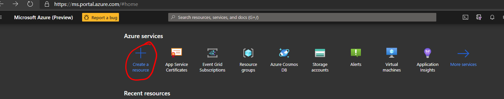
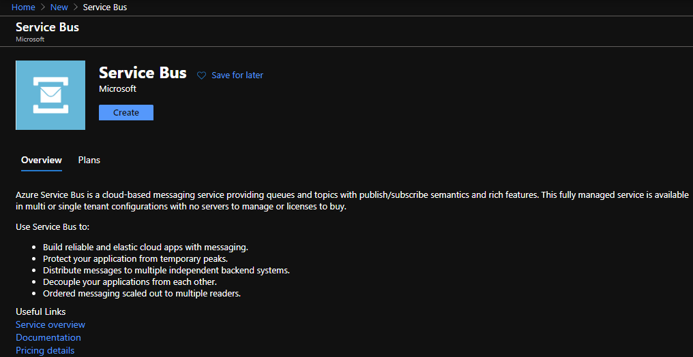
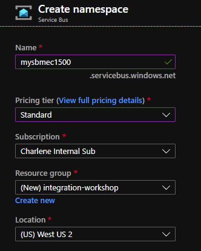
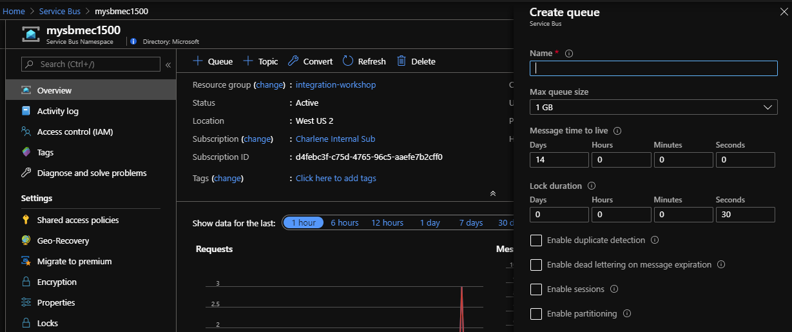
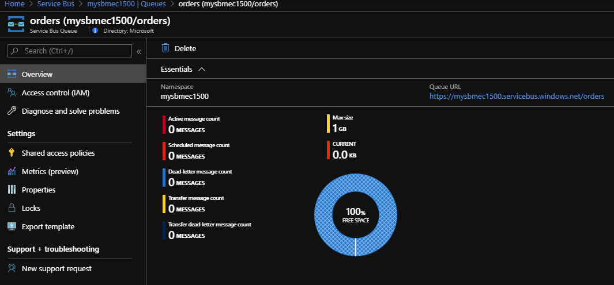
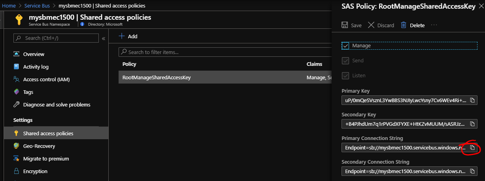
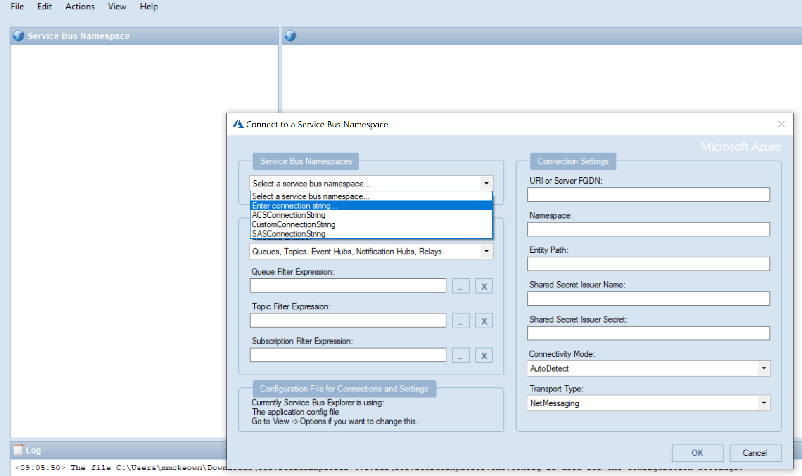
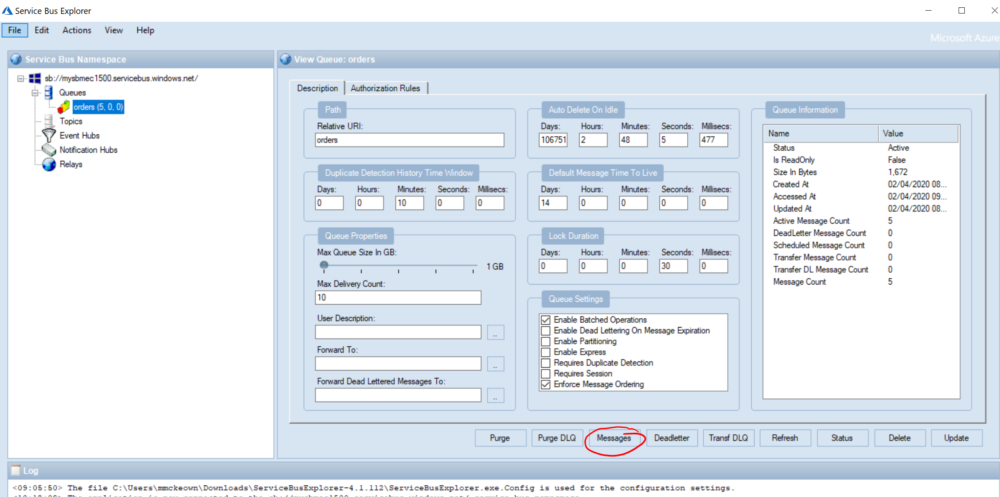
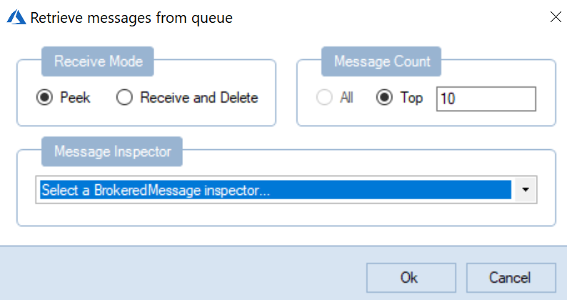

# Integration Workshop (Incomplete!)

>Note: Todo: Blurb about integration services

##Lab 1: Service Bus and Event Grid

>Note: Blurb about service bus and event grid!

### Create resources

1. Log into the Azure portal and click on **Create a resource**:

2. Search for **Service Bus**, select it, and then hit the **Create** button:

3. Enter a **unique name** for your service bus, select the **standard** pricing tier and create a new **resource group** - call it anything you like, and choose a **location**.

4. Click the create button. Wait a few minutes for it to create, then go to it. If you're not sure, type **Service Bus** in the search bar at the top of the Azure portal, and you should see it there.

5. Take a moment to explore the **Overview** page. Click **+Queue** at the top. 

6. Call your queue **orders** and leave everything else on default / unchecked and hit **Create**.  At this point, feel free to check out the [documentation](https://docs.microsoft.com/en-us/azure/service-bus-messaging/service-bus-queues-topics-subscriptions#queues) on Service Bus queues, and some of the features available. 

7. Click on your newly created queue to observe the dashboard for it - it should be empty.  

**Let's start sending messages to it!**

8. We will need a connection string to be able to send messages to the service bus queue, so click on **Shared Access Policies**, then **RootManageSharedAccessKey**.  Copy the **Primary Connection String** and paste it into notepad, as we will need it throughout this lab.

9. Let's deploy an Azure Function. 

>Note: What is a Function.. what is this function going to do etc.. 

10. tbd.. need to include Function code, and instructions on creating the output binding to service bus. 

### Examine messages with Service Bus Explorer

>Note: what is service bus explorer.. including link to GitHub repo. 

1. Click [here](https://github.com/paolosalvatori/ServiceBusExplorer/releases/download/4.1.112/ServiceBusExplorer-4.1.112.zip) to download Service Bus Explorer.  Extract the files and double click on ServiceBusExplorer.exe to run. 

2. Click **File** and choose **Enter connection string** from the dropdown.  Paste in your connection string on the box when it appears on the right hand side.

3. You will see your service bus and its properties - in this case, we can see a service namespace and a queue called **orders**. You should see some orders in the queue. Click on **Messages** to examine some of these.

We just want to peek at the messages for now, so leave the defaults here and click **Ok**.

You will see a list of orders, with JSON formatted content.  Each message has a **MessageId**, a **Sequence order** and **Size**, amongst other attributes.