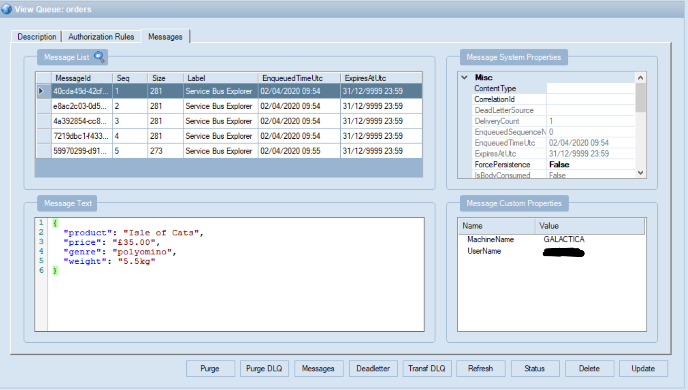
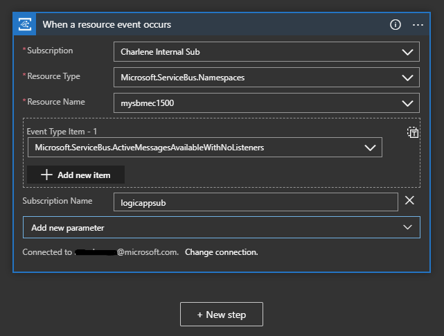

# Integration Workshop

The goal of this lab and subsequent labs, is to get you familiar with Azure Integration Services. 

No application is an island - more and more, we are seeing organisations face challenges in connecting their applications, particularly when the integration requires connecting to multiple, independent systems, often in complex ways.

Azure Integration Services is an iPaaS (integration Platform as a Service)solution that can help organisations connect applications, wherever they are. It is comprised of four core services, however they can be used independently of one another, or together as a rich integration platform. These are:

1. Service Bus
1. Logic Apps
1. Event Grid
1. API Management

Observe the picture below:


During this lab, you will start to build out something that resembles this picture, starting with Service Bus and Event Grid.  The goal is to have something producing messages (in this case, a Function App), which are sent to Service Bus. Event Grid will trigger a Logic App that will process the messages, as and when they are sent.  In a follow up lab, API Management will be used to protect our Logic App and our Function App that is sending messages. 

## Lab 1: Service Bus and Event Grid

The essence of application integration is software talking to other software. But how should this communication happen? Sometimes, a direct call via API Management is perfect. In other cases, though, this synchronous style of communication won’t work. What if both applications aren’t available at the same time, for instance? For situations like this an asynchronous approach is required. This kind of communication is exactly what **Service Bus** provides.

There are lots of integration scenarios in which communication through messages rather than API calls is the best approach. But requiring receiving software to periodically check whether a new message has
arrived—commonly known as polling—can be wasteful. Why not let a receiver be notified via an event instead? This is exactly what **Event Grid** allows. Rather than requiring a receiver to poll for new messages, the receiver instead registers an event handler for the event source it’s interested in. Event Grid then invokes that event handler when the specified event occurs.

### Create resources

1. Log into the Azure portal and click on **Create a resource**:


2. Search for **Service Bus**, select it, and then hit the **Create** button:


3. Enter a **unique name** for your service bus, select the **Premium** pricing tier and create a new **resource group** - call it anything you like, and choose a **location**.


4. Click the create button. Wait a few minutes for it to create, then go to it. If you're not sure, type **Service Bus** in the search bar at the top of the Azure portal, and you should see it there.

5. Take a moment to explore the **Overview** page. Click **+Queue** at the top. 


6. Call your queue **orders** and leave everything else on default / unchecked and hit **Create**.  At this point, feel free to check out the [documentation](https://docs.microsoft.com/en-us/azure/service-bus-messaging/service-bus-queues-topics-subscriptions#queues) on Service Bus queues, and some of the features available. 

7. Click on your newly created queue to observe the dashboard for it - it should be empty.  


**Let's start sending messages to it!**

8. We will need a connection string to be able to send messages to the service bus queue. Return to the overview of your Service Bus Namespace (not the queue you just created) and then click on **Shared Access Policies**, then **RootManageSharedAccessKey**.  Copy both the **Primary Key** and the **Primary Connection String** values and store them somewhere handy, such as in notepad, as we will need them throughout this lab.


9. Let's deploy an Azure Function. 

    We're going to use an Azure Function, which is a serverless application, to push messages into our Service Bus queue.

    Return to the Azure Portal's main dashboard and choose **Create a resource** again


This time, search for **Function App**, select it, and then hit the **Create** button:


On the **Basics** page, you can either select the same **Resource Group** where you deployed your Service Bus, or you can create a new resource group.

Choose a name for your Function App, then ensure the settings match those below. In particular, we're going to use **Node.js** for our Function Apps code.


Click the **Review + Create** button, then click the **Create** button at the bottom of that page. The deployment of the Function App will commence and should complete in about a minute.


Click the **Go to resource** button


10. Now we will create a Function. Click the **+ New Function** button.


Select the **In-Portal** option and then click **Continue**


We want a function that will run on a schedule, so choose the **Timer** option and then click **Create**


A function application allows us to define a Trigger that is used to initiate the function, as well as inputs and outputs. In this case, we want to modify the trigger to determine how often the function will run and we want to modify the output to send messages to Service Bus.

Click the **Integrate** link on the left hand side


Now, we will change the schedule so that the function runs every 30 seconds. Paste the following value into the **Schedule** box

```*/30 * * * * *```

It should look like the following


If you're familiar with the ```cron``` scheduler in Linux, this is using the same format to specify how often the function will run.

Click the **Save** button to save the new schedule.

Next, we will create a new output so that we can send messages to service bus.  Click the **+ New Output** button.


Now select **Azure Service Bus** and then click **Select**


Change the **Message Type** to **Service Bus Queue**

To the right of **Service Bus Connection**, you should see a **new** link. Click that link


You should now see a list of available Service Bus namespaces. Choose the one you created earlier and then click **Select**


Finally, change the **Queue name** to **orders** and click the **Save** button.


Now we need to provide the code for the function to run. Click on the **TimerTrigger1** link.


You will see a code window on the right hand side. Replace **all** of the code with the following:

``` javascript
module.exports = async function (context, myTimer) {
    var timeStamp = new Date().toISOString();
    
    var message = {
        product: 'Isle of Cats',
        price: '£35.00',
        genre: 'polyomino',
        weight: '5.5kg',
        orderDate: timeStamp
    };

    context.log('JavaScript timer trigger function ran at', timeStamp);   
    context.bindings.outputSbMsg = [];
    context.bindings.outputSbMsg.push(message);
    context.done();
};
```
This is a very simple function that is just going to write some JSON formatted data to a service bus message.

Click the **Save and run** button at the top of the page. After a few moments, you should see some messages in the Logs section indicating that the function is running successfully

```
2020-04-07T21:20:00.021 [Information] Executing 'Functions.TimerTrigger1' (Reason='Timer fired at 2020-04-07T21:20:00.0206139+00:00', Id=b3233bf3-82cd-4bb8-b326-873b529ea61f)
2020-04-07T21:20:00.025 [Information] JavaScript timer trigger function ran at 2020-04-07T21:20:00.018Z
2020-04-07T21:20:00.150 [Information] Executed 'Functions.TimerTrigger1' (Succeeded, Id=b3233bf3-82cd-4bb8-b326-873b529ea61f)
```

### Examine messages with Service Bus Explorer

>Note: Service Bus Explorer allows users to connect to a Service Bus namespace and efficiently administer messaging entities. The tool provides advanced features like import/export functionality or the ability to test topic, queues, subscriptions, relay services, notification hubs and events hubs. 

>Note: If you are following this lab as part of a hosted Microsoft workshop, then you should find Service Bus Explorer already installed on your VM - please run it from the desktop shortcut and skip to step 2.

1. Click [here](https://github.com/paolosalvatori/ServiceBusExplorer/releases/download/4.1.112/ServiceBusExplorer-4.1.112.zip) to download Service Bus Explorer.  Extract the files and double click on ServiceBusExplorer.exe to run. 

2. Click **File** and choose **Enter connection string** from the dropdown.  Paste in your primary connection string that you saved earlier in the box when it appears on the right hand side.


3. You will see your service bus and its properties - in this case, we can see a service namespace and a queue called **orders**. You should see some messages in the queue. Click on **Messages** to examine some of these.


We just want to peek at the messages for now, so leave the defaults here and click **Ok**.




You will see a list of messages.  Each message has a **MessageId**, a **Sequence order** and **Size**, amongst other attributes.

### Event Grid integration

So now we have messages flowing from an Azure Function into your Service Bus queue. What we need to do now is have some other service pick up those messages as and when they arrive.


1. Navigate back to the Azure portal, and click on **Create Resource** just like earlier. Search for **Logic App** and select **Logic App**. 

2. Select your subscription and your resource group and give your Logic App a name, something like **order-process**. Select the same region you used before, and optionally, enable **Log Analytics**. Click **Create**.


After a few moments, your Logic App should be created. 

3. Navigate to your new Logic App, and you should automatically see the Designer screen. If not, click **Designer** on the left hand pane. We want the Logic App to process an order as and when they come in, using a push strategy.  

You will notice this screen:


There are two triggers of interest:

**- When a message is recieved in a Service Bus Queue** and
**- When an Event Grid resource event occurs**

We could use either, however - the first trigger uses a polling method under the covers, and we already know that a push method is more efficient. By reacting to a resource event using the Event Grid trigger, we can do this.

4. Choose the **Event Grid resource event** trigger and follow the instructions on the next screen to sign into your Azure tenant (click the + icon). Once you have done that, select **Continue**.


5. You should now see a list of fields that we need to complete.  Choose your subscription, and for Resource Type, choose **Microsoft.ServiceBus.Namespaces**. Choose your service bus in the next field, and finally add an event type of **Microsoft.ServiceBus.ActiveMessagesAvailableWithNoListeners**. 

Click on **+ Add new parameter** and choose **Subscription Name** and call it **logicappsub**. 




6. Click **+ New Step**.

7. Search for **service bus** under **Choose an action**, and then choose **Get messages from a queue (peek-lock)**. 


8. On the next screen, give the connection a name (this can be anything) and choose your service bus namespace.  You will need to choose an access policy - for this, simply choose **RootManageSharedAccessKey** and click **Create**.


9. Select your service bus queue and leave everything else on default. 


10. We could multiple things at this point - there are over 200 built in connectors for Logic Apps, connecting to enterprise applications such as Dynamics, SAP, Office 365 and to consumer applications such as Dropbox, Gmail and Outlook. 

In the next lab, we will look at Logic Apps in more depth, so for now - let's simply send an email to confirm that an order has been received.

11. Click on **+ New Step** and choose whichever email provider you prefer.  In this example, I will use an Office 365 Outlook connector.

12. Once you have authenticated, you can begin to build out the content of your email.

You will notice that when you click on the fields, you have access to **dynamic data** based on previous actions. 


If I click on **Body** and choose **Content** as the dynamic data, the Logic App is smart enough to switch to a foreach loop. 

Now, for every service bus message processed, it will send an email with the content of that specific message. 


13. Finally, once the Logic App has processed the message, we need to tell service bus to go ahead and complete the message - it has been dealt with. Happily, there is an action for that! Click on **Add an action** directly below the **Send an email** step, and choose **Service Bus** 

14. Look for **Complete the message in a queue** and complete it so it looks like the below image.  When you click on the **Lock token** and **Session id** fields, you should be able to choose from the dynamic data pop out as shown above. 


15. Finally, save and run your workflow!

You should a successful run, and soon some emails appearing in your inbox. 


You can go and look at the Event Grid subscription that was set up for us behind the scenes.

16. In the search bar at the top, search for **Event Grid Subscriptions** and click on it. Filter on **Topic Type - Service Bus Namespaces** and your subscription and location. You should see an **Event Grid Subscription** matching the name you chose in the Logic App step. Click on it and explore some of the tabs; you can see metrics, filter options, features like retry policies, dead-lettering and batching as well as the webhook endpoint for your Logic App, which was configured when the Logic App Event Grid connector was created as part of your workflow. 


### Event Grid

Let's explore event grid a bit more. 

First of all, go back to the Logic App and disable it:


1. Create a storage account - you can search for **Storage account** in the top search bar, select it and then click on + Add to create a new one. Give it a unique name, and use the settings from the image below as reference. Click **Review + create** then **create**. 


2. After a few moments, it will have created. Go to your new storage account, and create a new container by selecting **Containers** on the left hand pane, and then **+ Container**. Call it **files** and leave it on **private access** and hit **Create**.


3. Click **Events** on the left hand side and then **+ Event Subscription**. 


4. Give the subscription a name, and then choose Service Bus Queue as the endpoint, selecting **orders** as the specific queue. Don't hit create yet.


Click on the **Filters** next, then select **Enable subject filtering**. In the **subject ends with** field, type **.pdf**. Click **Create**.


5. Click on **Storage Explorer (preview)** on the left hand side, then navigate to your container. 


6. Click **Upload** and when prompted, select the folder on your VM desktop called **files**. Select all files within it, and hit open.  You should now be able to click the **upload** button to upload the files to your container. 


7. Go back to Service Bus Explorer and refresh the service bus queue **orders**.  You should now see some new messages on there.  Click on **Messages** and retrieve **Top 10**. 

You should see two new messages which match our filter for files ending in .pdf. Event grid ignored everything else we uploaded, and only created two events - one for each PDF file we uploaded. 

Explore the schema and data payload:


```
{
  "topic": "/subscriptions/xxxxxx-xxxx-xxxx-xxxx-xxxxxxxxxxxx/resourceGroups/integration-workshop/providers/Microsoft.Storage/storageAccounts/integrationwotkshopstore",
  "subject": "/blobServices/default/containers/files/blobs/inclusive_toolkit_manual_final.pdf",
  "eventType": "Microsoft.Storage.BlobCreated",
  "eventTime": "2020-04-07T07:28:58.2702865Z",
  "id": "b337fb4a-f01e-0070-58ae-0c273706f7fe",
  "data": {
    "api": "PutBlockList",
    "clientRequestId": "beaeac2e-365e-4e92-ab4f-98cc21aba038",
    "requestId": "b337fb4a-f01e-0070-58ae-0c2737000000",
    "eTag": "0x8D7DAC556036FF4",
    "contentType": "application/pdf",
    "contentLength": 21990001,
    "blobType": "BlockBlob",
    "url": "https://integrationwotkshopstore.blob.core.windows.net/files/inclusive_toolkit_manual_final.pdf",
    "sequencer": "000000000000000000000000000000C900000000005ca013",
    "storageDiagnostics": {
      "batchId": "5542ea5d-0006-0003-00ae-0c57f4000000"
    }
  },
  "dataVersion": "",
  "metadataVersion": "1"
}
```

The information within the nested **data** object is specific to our event source, in this case blob storage. Everything outside of that object is what we refer to as common event information. 


## Wrap up & Clean up

Hopefully this lab has helped to get you more familiar with event grid and service bus and how they can be used independently but also together to enable event driven architecture and reliable messaging. 

In subsequent labs, we will work with Logic Apps in more depth, as well as introducing API Management.

Don't forget to delete your resources afterwards - if you were following along as part of a hosted workshop, we will delete your resource group and resources following lab completion. 
