# API Management Hands on Lab

## What is API Management?
The Azure API management (APIM) service is hosted in the Azure cloud and is positioned between your APIs and the Internet. An Azure API gateway is an instance of the Azure API management service.

When you publish your APIs, you use the Azure portal to control how particular APIs are exposed to consumers. You might want some APIs to be freely available to developers, for demo purposes, and access to other APIs to be tightly controlled.

Suppose you are the lead developer for an online shoe company. The company is growing quickly and wants to optimize its supply chain. One component of this optimization is to expose some internal data and processes, such as inventory and planning, to partners so they can directly access information on current stock levels. You want to provide partner access through a set of web APIs. These APIs will be published on the public Internet, but only partner applications should be able to use them. Your company and your partners want to minimize the costs of integration, and your developer teams want to focus on the business logic, not secondary concerns such as authorization.

## About this lab

In this guided lab, you will create an API gateway to securely publish an API and explore many of the features available in API Management. At the end of the lab there are challenges designed to stretch you. At any point, you can stop the guided part of this lab and start the challenges.

>Note: If you are taking part in this lab as part of a Microsoft UK CSU hosted event, please skip the setup step - we have provisioned everything for you in your own tenant. Log in to the Azure portal and find your resource group. Click on the Web API and copy the URL for the Web API into notepad, **adding swagger/v1/swagger.json** to the end of it. It should look like:

https://shoecoapid10567482d.azurewebsites.net/swagger/v1/swagger.json

Proceed to Part 1 below.


## Setup

Log into the Azure Portal and open the Cloud Shell. The icon looks like this:


If this is the first time you have used Cloud Shell, you will be prompted to allow it to create a storage account - go ahead and accept.

Make sure you have selected a Bash environment, then copy, paste and run the below commands one at a time:

**Create a resource group:**
```
az group create -n APIM-rg -l centralus
```
**Create API Management:**

>Note: It can take around 30 minutes for APIM to create and activate the service.  You could use the Consumption sku instead which only takes a few minutes, however you may find that you need at least the Developer sku to explore all of the features in this guide.
```
az apim create --name MyApim<insertrandomnumber> -g APIM-rg -l centralus --sku-name Developer --publisher-email <insert your email> --publisher-name <insert your name or company name>
```
**Clone the GitHub repo which contains source code for a .NET Core web API:**
```
git clone https://github.com/CharleneMcKeown/mslearn-publish-manage-apis-with-azure-api-management.git
```
**Change directory:**
```
cd mslearn-publish-manage-apis-with-azure-api-management/
```
**Run the setup script:**
```
bash setup.sh
```


>Note: if you experience failures running the second command, please ensure you have the API Management instance a unique name - it must be globally unique. 

The setup command should take a minute or two to run - it is deploying .NET Core app that generates inventory and product information. The app includes Swashbuckle to generate OpenAPI Swagger documentation. Once it is complete, it will display two URLs - copy these and paste these into Notepad. 

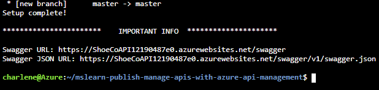

You can explore the API you just deployed by pasting the first URL into your browser. You will see the Swagger UI and RESTful endpoints:

- **api/inventory**, which generates a list of products and the number in stock
- **api/inventory/{productid}**, which returns the number in stock for the specified - productid (an integer)
- **api/Products**, which generates a list of products
- **api/Products/{productid}**, which returns the details for the specified productid

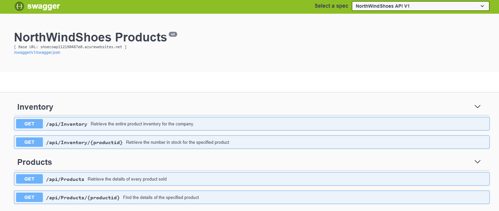

You can now start the Lab!

## Part 1 - Import and test your API

To make an API available through an API gateway, you need to import and publish the API.

In the shoe company example, NorthWind Shoes wants to enable selected partners to be able to query inventory and stock levels.

Making an API available starts with importing the API into API Management. You can then:

- Use the visualization tools in the API gateway to test out your API.
- Manage access to your APIs using policies.

There are several ways to import an API into Azure API Management as pictured below. You might have a RESTful API hosted in an Azure Function, or a HTTP triggered Logic App that you want to expose to developers. You can import these Azure based services directly from API Management.

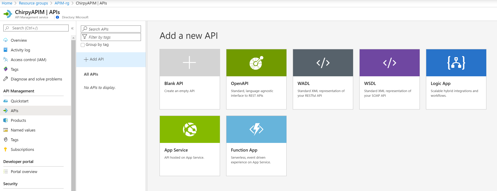

In this lab, we are going to use the **OpenAPI** specification.

1. Navigate to your newly created API Management service and click on **APIs**.
1. Click on **Add API** then **OpenAPI**.
1. Paste in the second (JSON) URL you saved earlier into the OpenAPI specification field. The rest should autopopulate for you:

    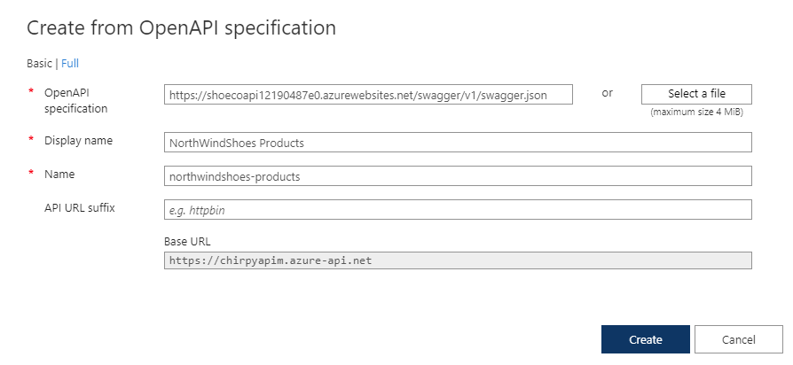

1. Click **Create**

    You will see your newly created API - **NorthwindShoes Products**. 
    You can call API operations directly from the portal which is a convenient, visual way of viewing and testing all operations associated with your APIs.

1. Make sure the API you just created is selected, and then click on the **Test** tab. Select the third **GET** operation. This operation will get the entire product catalogue. Note the **Ocp-Apim-Subscription-Key** is filled in automatically for the primary subscription key associated with this API Management instance. Leave everything on default, and hit **Send**.

    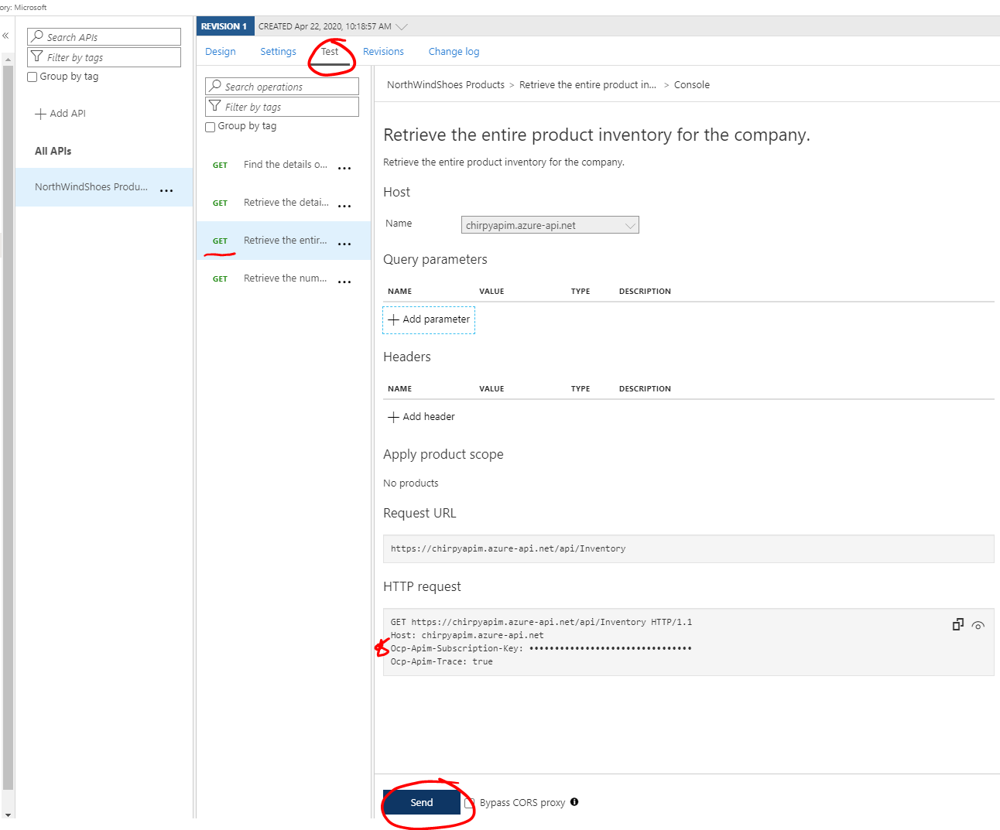

1. You should get a HTTP OK response with a status code of 200.  You will also see a JSON array of all product items in the inventory. 

1. You can explore the trace of this request by clicking on **Trace**.  The request is traced right through from the inbound request to APIM, the backend request to the API, and the outbound request (response) to the caller - in this case APIM. 

    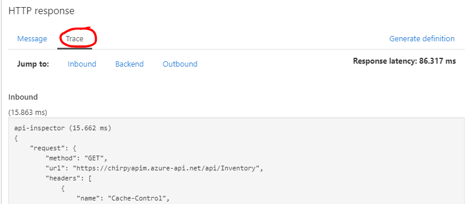
 

## Part 2 - Create a product and publish your API

Products are how APIs are surfaced to developers. Products in API Management have one or more APIs, and are configured with a title, description, and terms of use. Products can be Open or Protected. Protected products must be subscribed to before they can be used, while open products can be used without a subscription. 

When a product is ready for use by developers, it can be published. Once it is published, it can be viewed (and in the case of protected products subscribed to) by developers. Subscription approval is configured at the product level and can either require administrator approval, or be auto-approved.

1. Click **Products** under **API Management**. You will see some products that are already created for you - **Starter** and **Unlimited**.
1. Click **Add** to add a new product.
1. Give your product the name **Basic** to indicate something between Starter and Unlimited, give it a description and then toggle the **Published** button to on. 
1. Leave **Requires subscription** checked and click **Select API**, choosing the NorthWindShoes Products api.
1. Click **Create**.

    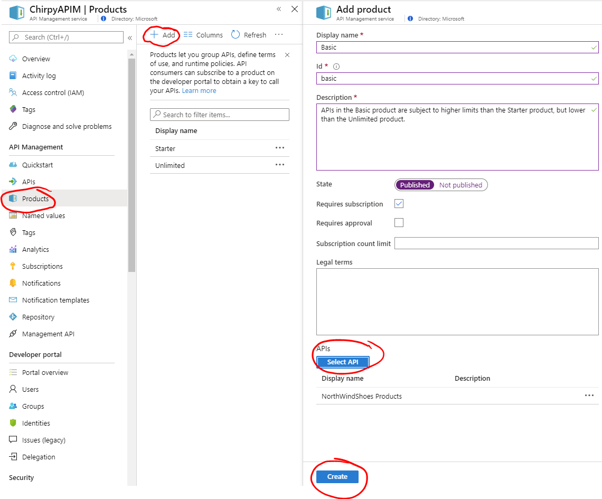

Now that you have a product, how do you make it visible to developers? 

**Groups** are used to manage the visibility of products to developers. Products grant visibility to groups, and developers can view and subscribe to the products that are visible to the groups in which they belong.
 
 1. Click on your newly created product and select **Access Control** from the menu. 
 1. Click on **Add Group** and choose **Developers** and **Guests**, then hit **Select**.

    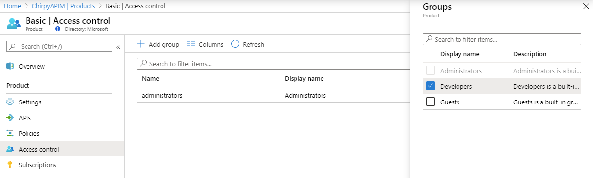

At this is a Basic product, it makes sense to protect the product with some rate limits. You can do this with **Policy**.

Policies are a powerful capability of the system that allow the publisher to change the behavior of the API through configuration. Policies are a collection of statements that are executed sequentially on the request or response of an API. 

Policies are applied inside the gateway which sits between the API consumer and the managed API. The gateway receives all requests and usually forwards them unaltered to the underlying API. However a policy can apply changes to both the inbound request and outbound response.

Policies can be applied at different **scopes**:

- Globally
- Product (a collection of APIs)
- API (a single API)
- Operation (a single operation in an API)


## Part 3 - Protect your API with policy

1. Click on the **Starter** product and then **Policies**.
    You will see an XML document with some statements already in the inbound section (which is applied to incoming requests).

    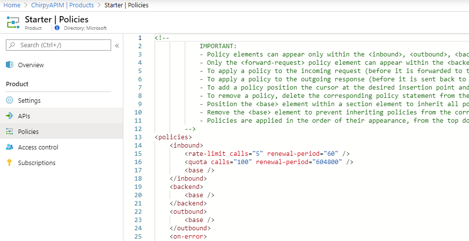

    There are two policies here:

    - The **rate-limit calls** policy specifies that a maximum of 5 API calls may be made in a 60 second period on the **Basic** product (the policy is applied at the product level).

    - The **quota calls** policy specifies that a total of 100 API calls may be made in a 7 day period on the **Basic** product. 

    Note the base tag. Any policies that were defined globally would also be applied, but after the first two policies as it occurs afterwards and therefore is evaluated last.

1. Copy and paste both of these policy lines into notepad. 
1. Go back to your products and click on **Basic** then **Policies**.
1. Update the XML document to insert the two policies you just copied.
1. Modify them to have increased limits then **Save**.

```
    <inbound>
        <rate-limit calls="20" renewal-period="60" />
        <quota calls="1000" renewal-period="604800" />
        <base />
    </inbound>
```

Now that you have published the NorthWindShoes Products API, it is time to customise and publish the Developer portal so that you can make your API discoverable.

## Part 3 - Customise and publish the developer portal

Up until now, you have been working with the Publisher portal which is available natively in the Azure portal. 

The Developer portal is an automatically generated, fully customizable website with the documentation of your APIs. It is where API consumers can discover your APIs, learn how to use them, request access, and try them out. 

You can self host your own developer portal, or you can make use of the built in developer portal, which is what you will do now.

1. Click on the **Developer Portal** button at the top of the page.  A new tab will open with an adminstrative view of the developer portal.

    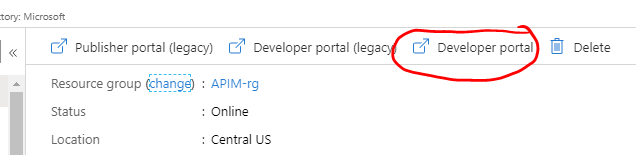

    You will see default content which has been generated to get you started.  Click around this page and you will see widgets like images and text boxes. 

    The portal is based on an adapted fork of the Paperbits framework. The original Paperbits functionality has been extended to provide API Management-specific widgets (for example, a list of APIs, a list of Products) and a connector to API Management service for saving and retrieving content.

    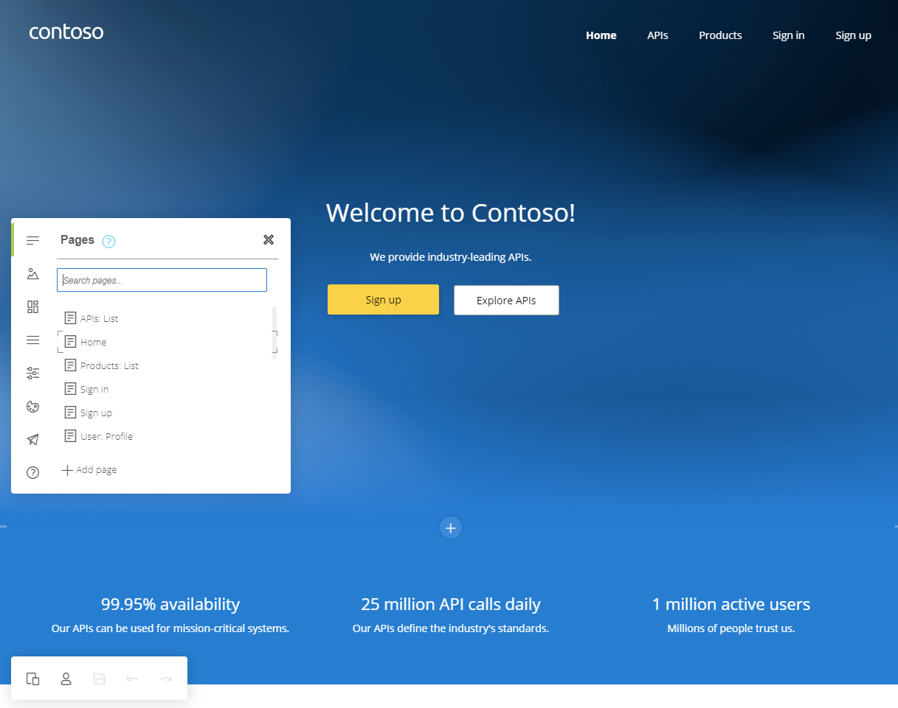

    Observe the menu on the let hand side.  Here you can do things like:

    - Add a new page 
    - Upload media
    - Change and add new layouts
    - Update navigation items
    - Publish your site

1. Make some changes to your site - for instance, update the logo, the name and description. 

1. Publish your site. In the left hand menu, you will see a paper airplane icon. Click on that to publish. Wait for about a minute, then refresh the page. You should see the published version of the site. 

1. Click on APIs at the top and then NorthWindShoes Products API. You will see a list of operations available for the API and a **Try It** button.

    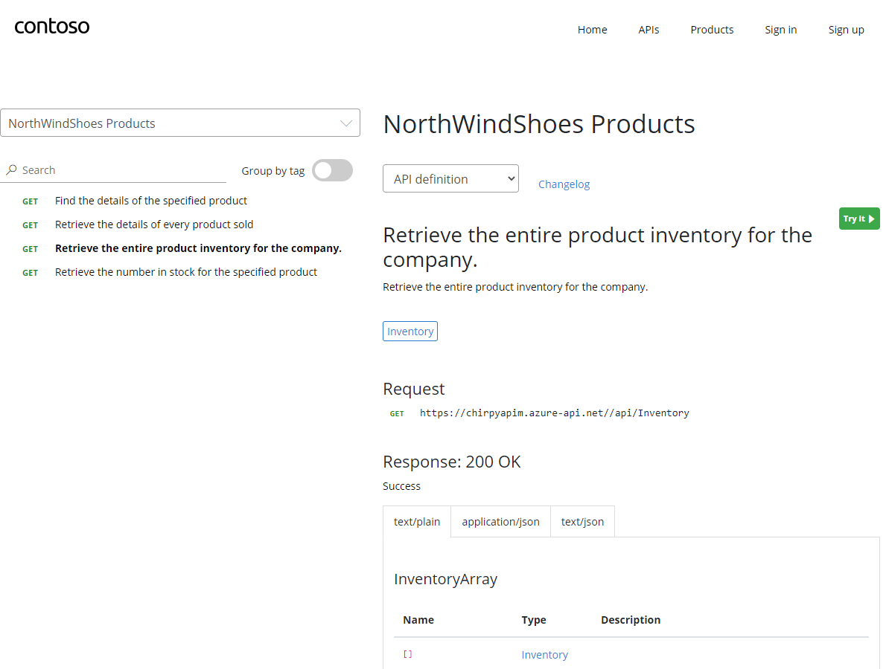

1. Click on the third operation **Retrieve the entire product inventory for the company** then on **Try it**.

    You will see an error at the bottom of the page:

    "Unable to complete the request - Since the browser initiates the request, it requires Cross-Origin Resource Sharing (CORS) enabled on the server."

    You can fix this with policy!

1. Go back to the Azure Portal and click on **APIs** then **NorthwindShoes Products**. Ensure **All operations** are selected then click on **Add Policy** in the inbound processing section.

    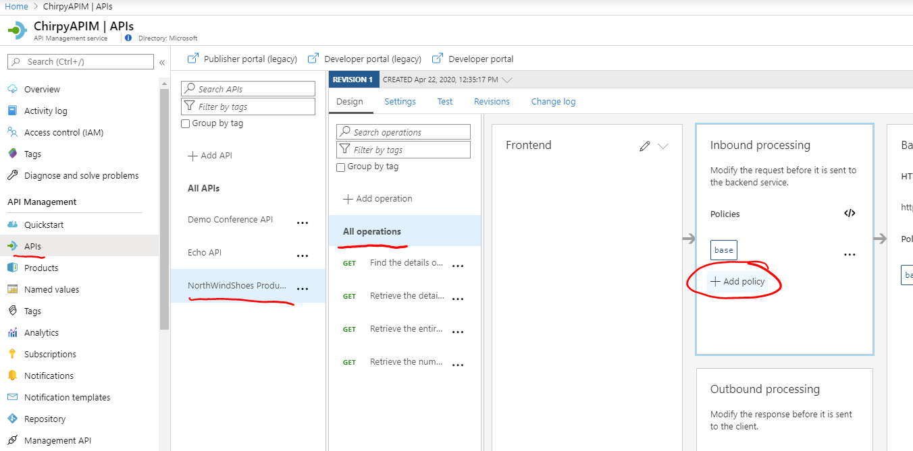

1. Select **Allow cross-origin resource sharing (CORS)**.

1. Fill it in so that it matches the image below.  You will need to click on **Full** to change the allowed headers and exposed headers.

    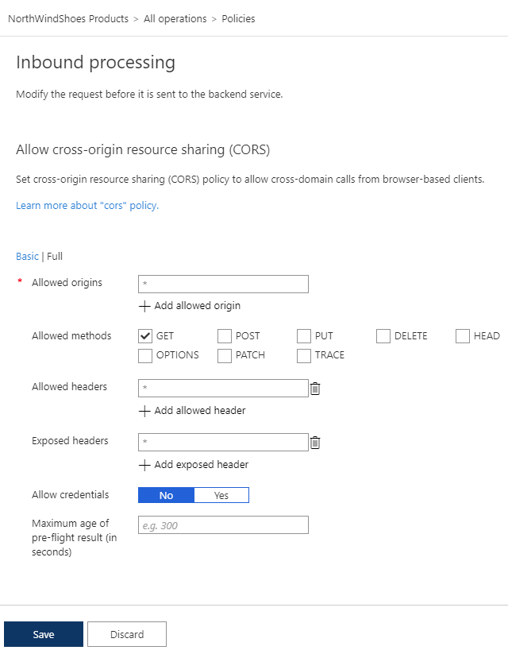

1. Go back to the developer portal and try the operation again.  You will still get an error, but this time it isn't a CORS error - that is fixed. You will see a 401 error, which makes sense. You need a subscription key to make API calls. When you did this in the publisher portal when testing your API, the subscription key was automatically inserted in as a header for you.

1. Go back to the Azure portal and select **Products** then **Basic** and finally **Subscriptions**. Click on the ellipsis to bring up the context menu, and choose **show keys**. Copy the Primary key.

    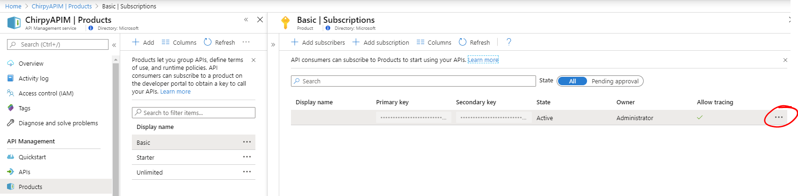

1. Go back to the developer portal, and paste in the primary key into the field for **Authorization: Subscription key** and try the operation again. You should get a 200 OK status code and a payload containing the inventory. 

    If a developer wanted to try out the API, they would create an account, sign in and subscribe to the product.

1. Make sure you are signed out of the developer portal. Click **Sign Up** on the homepage and follow that through, including confirming your email address.

1. Sign in to the developer portal using your new account, and then select **Products** from the top menu. 

1. Choose **Basic**, then give your new subscription a name and click the yellow **subscribe** button.  

A subscription is created for you on the Basic product which comes with a primary and secondary key. 

Now, when you go back to the NorthWindShoes product API, you will see that your developer subscription key is filled in for you.

## Part 4 - Add revisions and versions

APIM has support for versions and revisions, and it is useful to understand when you would use either feature.

- **Versions** allow you to present groups of related APIs to your developers. Versions differentiate themselves through a version number (which is a string of any value you choose), and a versioning scheme (path, query string or header).

- **Revisions** allow you to make changes to your APIs in a controlled and safe way. When you want to make changes, create a new revision. You can then edit and test API without disturbing your API consumers. When you are ready, you can then make your revision current – at the same time, you can post an entry to the new change log, to keep your API consumers up to date with what has changed.

With **versions** you can:

- Publish multiple versions of your API at the same time
- Use path/query string or header to differentiate between versions.
- Use any string value you wish to identify your version (a number, a date, a name).
- Show your API versions grouped together on the developer portal.

With **revisions**, you can:

- Safely make changes to your API Management API definitions & policies, without disturbing your production API.
- Try out changes before publishing them.
- Document the changes you make, so your developers can understand what is new.
- Rollback if you find issues.

1. Navigate to the NorthWindShoes Products API and select the **Revisions** tab. Click **Add revision** and give it a description then click **Create**.

    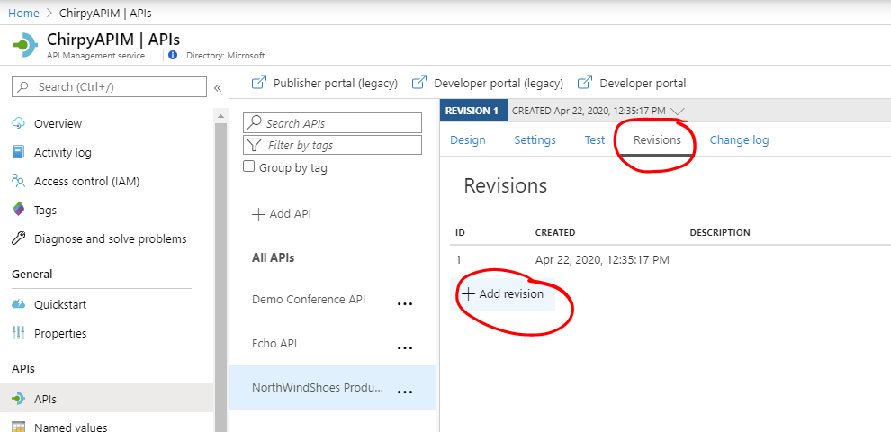

    Note that revision 2 is online, but not yet current:

    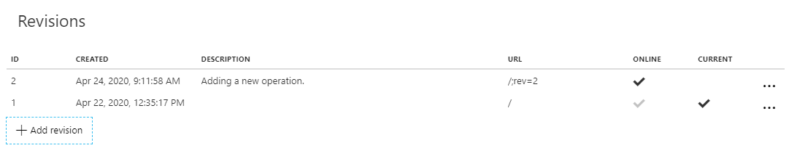

1. Click on **Add Operation** and create a new POST operation. Click **Save**.

    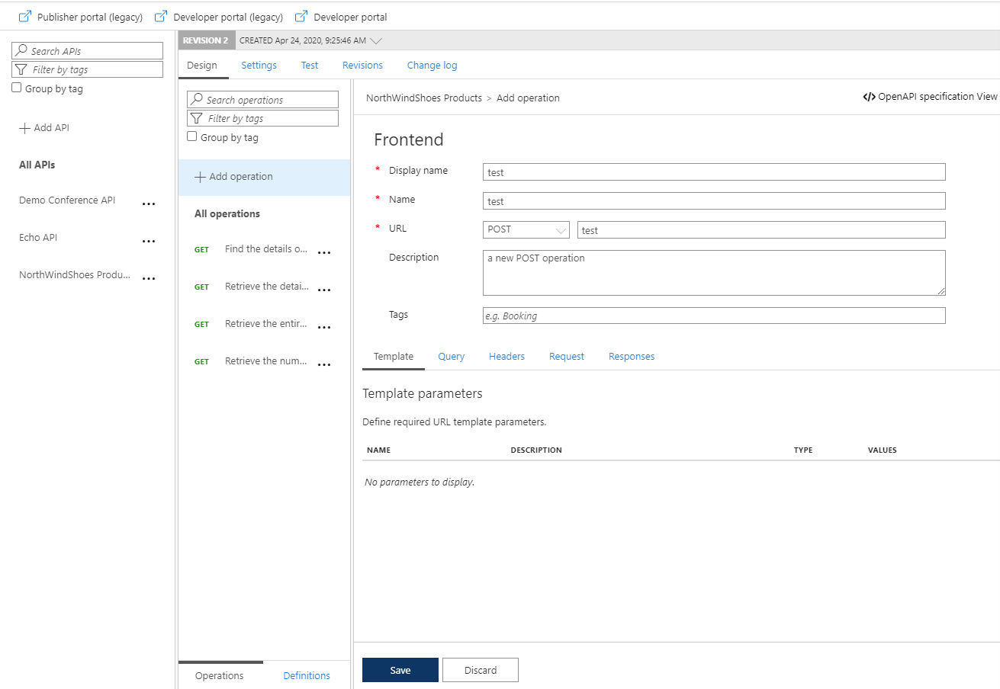

1. Click on **Revision 2** at the top of the blade and switch to revision 1. 

    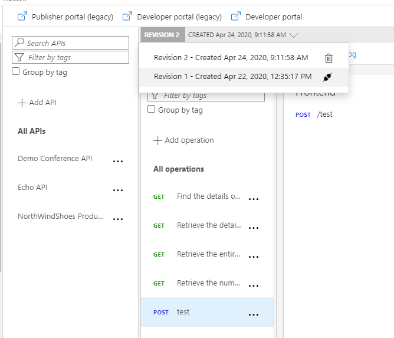

    You will notice that the new POST operation is not listed for revision 1. 

    As it is a non-breaking change, we can go ahead and simply make revision 2 the current revision.

1. Click on the **Revisions** tab and then the ellipsis for revision 2, and choose **Make current**.  Click on **Post to Public Change log** and write a brief description to let developers know what the change is (in this case, a new POST operation). 

    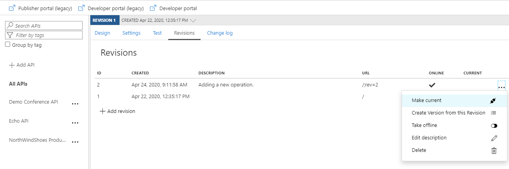

    You can view this change log post in the developer portal by clicking through to the API and selecting the new operation, then on the Changelog link:

    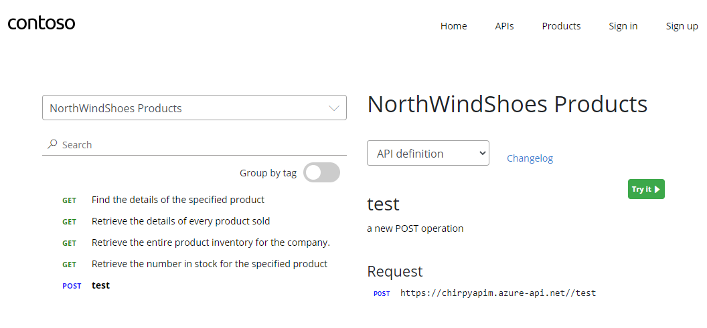

1. Back in the Publisher portal, click on the ellipsis for NorthWindShoes Products API and select **Add version**

    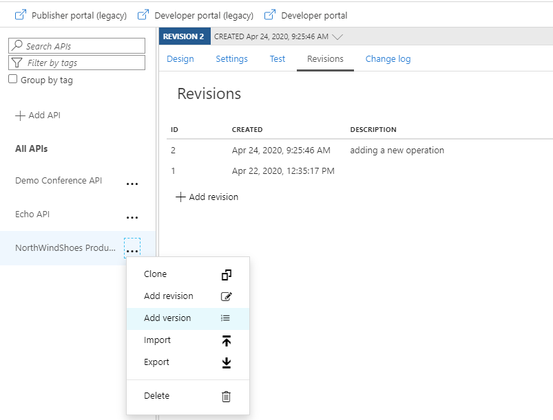

1. Give the version a name and choose **Path** for the versioning scheme and **v1** for the identifier. Notice the usage example. Experiment with other versioning schemes to see different usage examples. For instance, the **Query String** versioning scheme would result in an operation call that would look like this: **/[operation]?api-version=v1**

1. Click **Create**.

    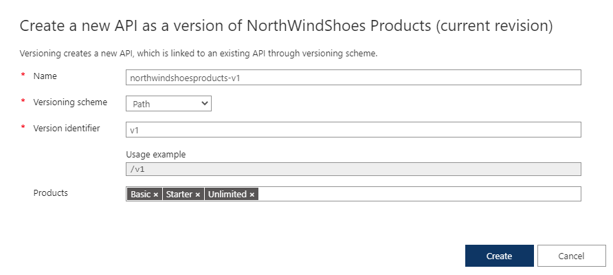

1. You will now see your API has two versions; the original and v1. 

    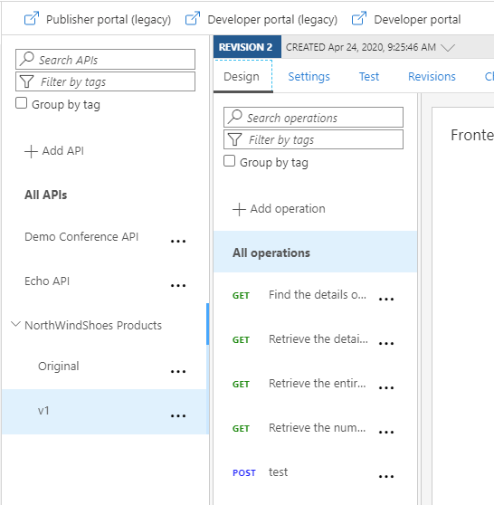

    Additionally, you can visit the developer portal and observe that you can now choose between the original API and v1.

    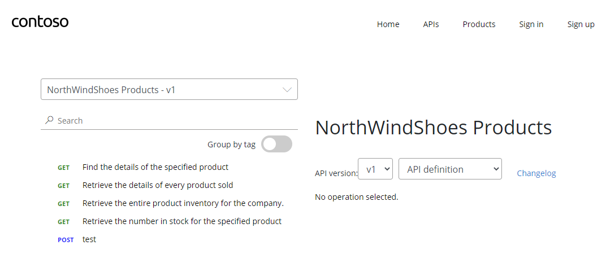

## Part 5 - Challenges

So far you have:

- Imported and Tested an OpenAPI API
- Created and published a Product
- Added an API to your Product
- Used policy to protect your Product from misuse
- Customised and Published your Developer portal
- Added revisions and versions

The following challenges are designed to stretch you rather than guide you. From using what you learned so far and by using the APIM documentation, you will be able to complete these. 

### Challenge 1 - Import an API

Import a new API. The specification can be found [here](https://conferenceapi.azurewebsites.net?format=json).  Make sure you add a suffix for this API, and call it **conference**. You will use this for the rest of the challenges.

### Challenge 2 - Implement key throttling

It is common to find that a few users over-use an API to the extent that you incur extra costs or that responsiveness to other uses is reduced. You can use throttling to limit access to API endpoints by putting limits on the number of times an API can be called within a specified period of time.

Key throttling allows you to configure different rate limits by any client request value. This type of throttling offers a better way of managing the rate limits as it applies the limit to a specified request key, often the client IP address. It gives every client equal bandwidth for calling the API.

**Your challenge is to implement key throttling on the API based on the caller IP address.** 


### Challenge 3 - Strip headers

Companies that publish web APIs often need to carefully control the HTTP headers that their APIs return, preferably without rewriting the API source code.

**Your challenge is ensure that the "x-powered-by" and "x-aspnet-version" headers are stripped from the API responses.**

### Challenge 4 - Replace strings

The Conference API currently returns original URLs in its response (see image below).

**Your challenge is to make sure that the backend URL in these reponses is replaced with the APIM gateway host address instead.**

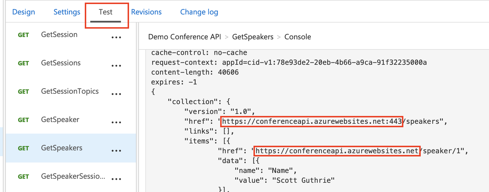

### Challenge 5 - Caching

Operations in API Management can be configured for response caching. Response caching can significantly reduce API latency, bandwidth consumption, and web service load for data that does not change frequently.

**Your challenge is to implement policy to cache responses for the "GetSpeakers" method in order to reduce API latency.  Do this using built in APIM policy and use tracing to validate that it worked. Set the cache to store responses for 20 seconds**

### Challenge 6 - Caching

Using an external cache allows to overcome a few limitations of the built-in cache. It is especially beneficial if you would like to:

- Avoid having your cache periodically cleared during API Management updates
- Have more control over your cache configuration
- Cache more data than your API Management tier allows to
- Use caching with the Consumption tier of API Management

**Your challenge is to use an external cache instead of the built-in cache.**


## Useful links for the challenges:

[APIM Policy Index](https://docs.microsoft.com/en-us/azure/api-management/api-management-policies)

